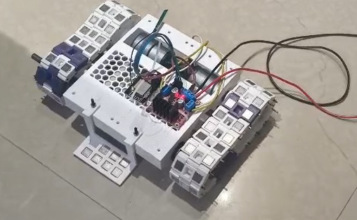
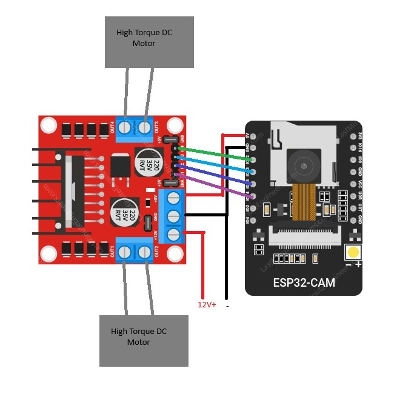
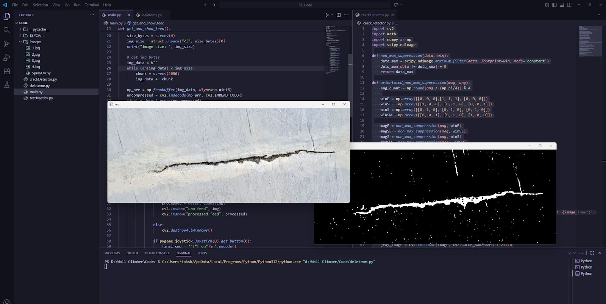

# Introducing Magnetic Crawler Inspection Robot with Automated Crack Detection

## 📌 Project Overview

The **Magnetic Crawler Inspection Robot** is a crawler-type robotic system made for inspecting **large metal surfaces** such as **ship hulls, super critical boilers, storage tanks, etc.**.  
The robot uses **magnetic adhesion** to climb in mostly all orientations and move on curved metal surfaces while inspecting for **cracks and other damages** using **OpenCV-based computer vision and other tricks**.

This project focuses on improving **industrial safety**, **inspection accuracy**, and **lowering maintanence time** by reducing the need for manual inspection in hazardous environments.

---

## Project Images

### Robot Prototype


### Circuit Diagram


### 3D Model Design


### Crack Detection Output


---

## ✨ Key Features ✨

- Strong magnetic adhesion for all orientation climbing
- "Tank Wheel" type mechanism for movement good stability  
- Camera and Optical Flow sensor based surface inspection  
- Crack detection using OpenCV  
- Remote / semi-autonomous operation ( Next Goal is fully autonomous )  
- Suitable for industrial inspection applications  

---

## ⚙️ Working Principle

1. **Neodymium magnets** are used to hold entire car body together.
2. A custom **Chain-Sprocket** mechanism which are fitted with the magnets.
3. This Mechanism is driven by high torque DC Motors.
4. A **camera module** captures real-time images of the surface. ( Soon to implement Optical Flow sensors )
5. Images are processed using **OpenCV algorithms**.
6. Surface cracks are detected and highlighted for analysis. ( Soon to have a plotting feature )

---


## 🔌 Hardware & Circuit Description ( First Version )

### Major Components Used
- Microcontroller (ESP32 Cam)
- Motor Driver (L298N)
- DC Geared Motors ( 12 Kgcm of torque)
- Neodymium Magnets ( 10x10x2mm )
- Camera Module ( ov2640 )
- Repurposed PC psu
- Voltage Regulator ( Used the in-built L298N 5V+ Pin )

---

## 3D Model Design ( First version )

The robot chassis is designed using **On Shape / Sketchup** with the following considerations:
- Compact and lightweight structure  
- Balanced weight distribution ( Didnt affect much )     
- Optimized crawler layout for curved surfaces  ( Somewhat working, to implement fully )

---

## Crack Detection Using OpenCV

### Image Processing Steps
- Convert the image to grayscale
- Reduce noise using Gaussian blur
- Highlight sharp details using filtering
- Detect edges using image gradients
- Remove weak or unwanted edges
- Thin edges to keep only the strongest ones
- Clean up and connect broken edges

### Edge Detection Features
- Uses a custom edge detection method
- Detects clean and thin crack edges
- Works well even with some noise
- Sensitivity can be easily adjusted

## Controller Based Robot Control

The Magnetic Crawler Inspection Robot can be **manually controlled using an Xbox controller**.  
This is the only way to control the robot right now. In-Dev version is set to be automated when giving dimensions of the target surface.

---

###  Controller Mapping

| RB / LB | Forward/Backward |
| A Button | Capture And Detect Crack |
| B Button | Turn Right |
| X Button | Turn Left |
| R Joystick Click | Emergency Stop | 

---

### Libraries Used
```bash
pygame
pyserial
opencv-python
numpy
